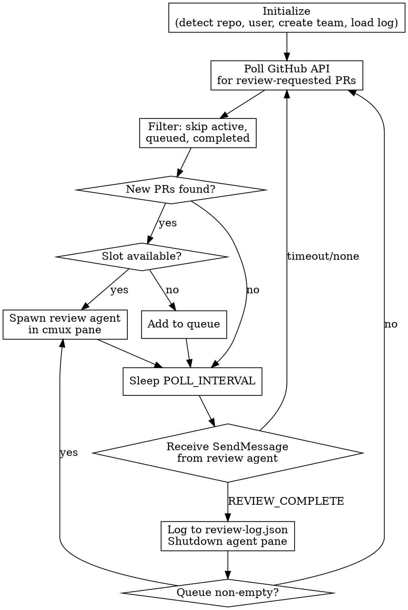

# Review Orchestrator Implementation Plan

> **For agentic workers:** REQUIRED SUB-SKILL: Use superpowers:subagent-driven-development (recommended) or superpowers:executing-plans to implement this plan task-by-task. Steps use checkbox (`- [ ]`) syntax for tracking.

**Goal:** Build a persistent Claude Code orchestrator that polls GitHub for review-requested PRs on the current repo and spawns dedicated review agents as cmux team members.

**Architecture:** A shell script entry point launches `cmux claude-teams` with a skill prompt. The skill drives a polling loop using `gh api`, spawns review agents via the `Agent` tool with `team_name`, and tracks state via tasks and a JSON review log. Review agents run `/review`, present findings, stay interactive, then `SendMessage` back on completion.

**Tech Stack:** Claude Code skills (markdown), cmux, `gh` CLI, `SendMessage`/`Agent`/`TeamCreate` tools

**Parallelization:** Tasks 1 and 2 are independent and can be worked on simultaneously. Task 3 depends on both.

---

## Task 1: Create the `review-orchestrator` shell script

**Files:**
- Create: `review-orchestrator`

**No dependencies — can run in parallel with Task 2.**

- [ ] **Step 1: Create the shell script**

```bash
#!/usr/bin/env bash
set -euo pipefail

export REVIEW_POLL_INTERVAL="${REVIEW_POLL_INTERVAL:-6}"
export REVIEW_MAX_CONCURRENCY="${REVIEW_MAX_CONCURRENCY:-3}"

# Verify we're in a git repo with a GitHub remote
if ! gh repo view --json nameWithOwner -q '.nameWithOwner' &>/dev/null; then
  echo "Error: not in a GitHub repository. Run this from a project directory." >&2
  exit 1
fi

REPO=$(gh repo view --json nameWithOwner -q '.nameWithOwner')
echo "Starting review orchestrator for $REPO"
echo "  Poll interval: ${REVIEW_POLL_INTERVAL}m"
echo "  Max concurrency: ${REVIEW_MAX_CONCURRENCY}"

cmux claude-teams --prompt "/start_reviewing_team"
```

- [ ] **Step 2: Make it executable**

Run: `chmod +x review-orchestrator`

- [ ] **Step 3: Verify the script validates correctly**

Run: `bash -n review-orchestrator`
Expected: no syntax errors

- [ ] **Step 4: Commit**

```bash
git add review-orchestrator
git commit -m "feat: add review-orchestrator entry point script"
```

---

## Task 2: Create the `/start_reviewing_team` skill

**Files:**
- Create: `.claude/skills/start_reviewing_team.md`

**No dependencies — can run in parallel with Task 1.**

- [ ] **Step 1: Create the full skill file**

Create `.claude/skills/start_reviewing_team.md` with the complete content below:

````markdown
---
name: start-reviewing-team
description: Use when launching a persistent code review orchestrator that polls GitHub for PRs requesting your review and spawns review agents as team members
---

# Start Reviewing Team

## Overview

Persistent orchestrator that polls GitHub for PRs requesting your review on the current repo, spawns review agents as cmux team members, and tracks completed reviews.

## Process Flow



## Initialization

1. Detect the current repo:

```bash
gh repo view --json nameWithOwner -q '.nameWithOwner'
```

2. Detect your GitHub username:

```bash
gh api user --jq '.login'
```

3. Read configuration from environment:
   - `REVIEW_POLL_INTERVAL` — minutes between polls (default: 6)
   - `REVIEW_MAX_CONCURRENCY` — max concurrent review agents (default: 3)

4. Create the team using `TeamCreate`:
   - `team_name`: `"review-team"`
   - `description`: `"Code review orchestrator for {repo}"`

5. Load existing review log from `.claude/review-log.json` if it exists. This tracks previously completed reviews to avoid re-dispatching.

6. Initialize in-memory tracking:
   - `active_reviews`: map of PR number to agent name
   - `queue`: ordered list of PRs waiting for a slot
   - `completed`: set of PR numbers (loaded from review log)

7. Print startup banner:

```
Review Orchestrator Started
Repo: {owner/repo}
User: {github_username}
Poll interval: {REVIEW_POLL_INTERVAL}m
Max concurrency: {REVIEW_MAX_CONCURRENCY}
Previously completed reviews: {count}
```

8. Use cmux status reporting:

```bash
cmux set-status repo "{owner/repo}" --icon eye --color "#58a6ff"
cmux set-status active "0/{MAX_CONCURRENCY}" --icon people --color "#196F3D"
cmux log --level info --source "orchestrator" -- "Started for {repo}"
```

## Polling Loop

After initialization, enter an infinite polling loop.

### Each cycle:

1. **Fetch review-requested PRs** using `gh api`:

```bash
gh api "repos/{owner}/{repo}/pulls?state=open&per_page=100" \
  --jq '[.[] | select(.requested_reviewers[]?.login == "{github_username}") | {number, title, html_url, author: .user.login}]'
```

2. **Filter out known PRs** — skip any PR number that is in `active_reviews`, `queue`, or `completed`.

3. **For each new PR:**
   - If `active_reviews` count < `REVIEW_MAX_CONCURRENCY`: spawn a review agent (see Spawning section)
   - Otherwise: add to `queue` and print:
     ```
     Queued PR #{number}: {title} (by {author}) — {active_count}/{MAX_CONCURRENCY} slots in use
     ```
   - Update cmux status:
     ```bash
     cmux set-status active "{active_count}/{MAX_CONCURRENCY}" --icon people --color "#196F3D"
     cmux log --level info --source "orchestrator" -- "New PR #{number}: {title}"
     ```

4. **Print cycle summary** (only if there were changes):
   ```
   Poll complete: {new_count} new, {active_count} active, {queue_count} queued
   ```

5. **Sleep** for `REVIEW_POLL_INTERVAL` minutes:
   ```bash
   sleep $((REVIEW_POLL_INTERVAL * 60))
   ```

6. **Repeat** from step 1.

### Important:
- The polling loop runs indefinitely until the user stops the session.
- Between polls, listen for `SendMessage` from review agents reporting completion (see Completion section).
- After processing a completion message, check the queue and dispatch if a slot opened.

## Spawning a Review Agent

When a slot is available for a new PR:

1. **Choose an agent name** based on the PR number: `reviewer-pr-{number}`

2. **Spawn the agent** using the `Agent` tool:
   - `name`: `"reviewer-pr-{number}"`
   - `team_name`: `"review-team"`
   - `description`: `"Review PR #{number}"`
   - `run_in_background`: `true`
   - `prompt`:

```
You are a code review agent for PR #{number} in {owner/repo}.

PR: {title}
Author: {author}
URL: {html_url}

## Your task:

1. Run `/review` on this PR to analyze the changes.

2. **Present your findings only.** Do NOT:
   - Post any comments on the PR
   - Apply any code fixes
   - Make any changes to files
   - Push any commits

3. After presenting findings, **wait for the user's instructions.** The user will tell you what to do next (approve, request changes, post specific comments, etc.).

4. When the user says the review is complete (e.g., "done", "review complete", "finished"), send a completion message back to the orchestrator:

Use SendMessage with:
- to: "team-lead"
- summary: "Review complete for PR #{number}"
- message: "REVIEW_COMPLETE|{number}|{outcome}|{one-line summary of findings}"

Where {outcome} is one of: approved, changes_requested, commented
```

3. **Track the agent**:
   - Add to `active_reviews`: PR `{number}` -> agent name `reviewer-pr-{number}`
   - Print:
     ```
     Spawned reviewer-pr-{number} for: #{number} {title} (by {author})
     ```
   - Update cmux:
     ```bash
     cmux set-status active "{active_count}/{MAX_CONCURRENCY}" --icon people --color "#196F3D"
     cmux log --level success --source "orchestrator" -- "Spawned reviewer for PR #{number}"
     cmux notify --title "Review Started" --body "PR #{number}: {title}"
     ```

## Handling Review Completion

When you receive a `SendMessage` from a review agent, parse the message.

### If the message contains `REVIEW_COMPLETE`:

Parse the message format: `REVIEW_COMPLETE|{pr_number}|{outcome}|{summary}`

1. **Log the review** — append to `.claude/review-log.json`:

```json
{
  "pr": 42,
  "repo": "owner/repo",
  "title": "PR title",
  "url": "https://github.com/owner/repo/pull/42",
  "author": "username",
  "dispatched_at": "2026-04-01T10:30:00Z",
  "completed_at": "2026-04-01T11:15:00Z",
  "outcome": "approved",
  "summary": "Clean implementation, minor suggestion on error handling"
}
```

Read the existing file (or start with `[]`), append the entry, and write it back.

2. **Clean up the agent**:
   - Remove from `active_reviews`
   - Send a shutdown request to the agent:
     ```
     SendMessage to "reviewer-pr-{number}" with message: {"type": "shutdown_request"}
     ```

3. **Dispatch from queue** — if `queue` is non-empty, pop the first PR and spawn a review agent for it.

4. **Update status**:
   ```
   Review complete: PR #{number} — {outcome}
   Summary: {summary}
   Active: {active_count}/{MAX_CONCURRENCY}, Queued: {queue_count}
   ```
   ```bash
   cmux set-status active "{active_count}/{MAX_CONCURRENCY}" --icon people --color "#196F3D"
   cmux log --level success --source "orchestrator" -- "Completed PR #{number}: {outcome}"
   cmux notify --title "Review Complete" --body "PR #{number}: {outcome}"
   ```

### If the message is something else:

The review agent may be asking a question or reporting an issue. Print the message and respond as needed.
````

- [ ] **Step 2: Verify the skill file has correct frontmatter**

Run: `head -5 .claude/skills/start_reviewing_team.md`
Expected: YAML frontmatter with `name: start-reviewing-team` and `description` starting with "Use when"

- [ ] **Step 3: Commit**

```bash
git add .claude/skills/start_reviewing_team.md
git commit -m "feat: add start_reviewing_team skill for review orchestration"
```

---

## Task 3: End-to-end verification

**Files:** None (verification only)

**Depends on: Task 1 and Task 2.**

- [ ] **Step 1: Verify the shell script runs and detects the repo**

Run from the project directory:
```bash
./review-orchestrator
```

Expected: Script prints the repo name, poll interval, and max concurrency, then launches `cmux claude-teams` with the skill prompt.

- [ ] **Step 2: Verify the skill is discovered**

Inside the cmux Claude session, check that `/start_reviewing_team` is recognized as a skill.

- [ ] **Step 3: Verify the GitHub API query works**

Run manually:
```bash
REPO=$(gh repo view --json nameWithOwner -q '.nameWithOwner')
USER=$(gh api user --jq '.login')
gh api "repos/${REPO}/pulls?state=open&per_page=100" \
  --jq "[.[] | select(.requested_reviewers[]?.login == \"${USER}\") | {number, title, html_url, author: .user.login}]"
```

Expected: JSON array (possibly empty) of PRs requesting your review.

- [ ] **Step 4: Test with a real PR (if available)**

If there's a PR requesting your review, verify the orchestrator detects it and spawns a review agent in a new cmux pane.

- [ ] **Step 5: Commit any fixes found during testing**

```bash
git add -A
git commit -m "fix: address issues found during manual testing"
```
